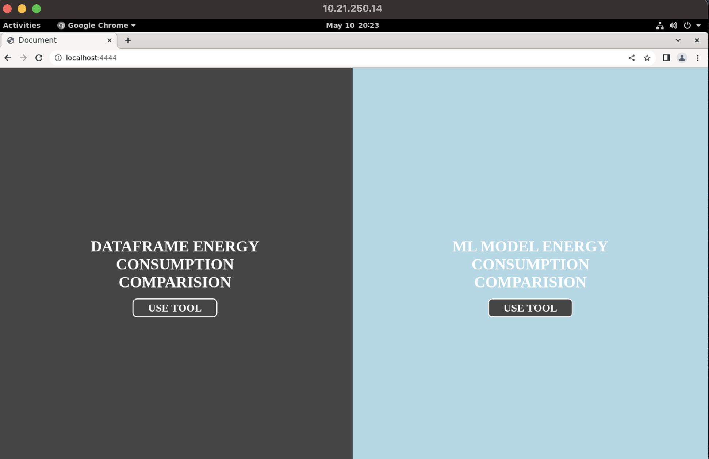
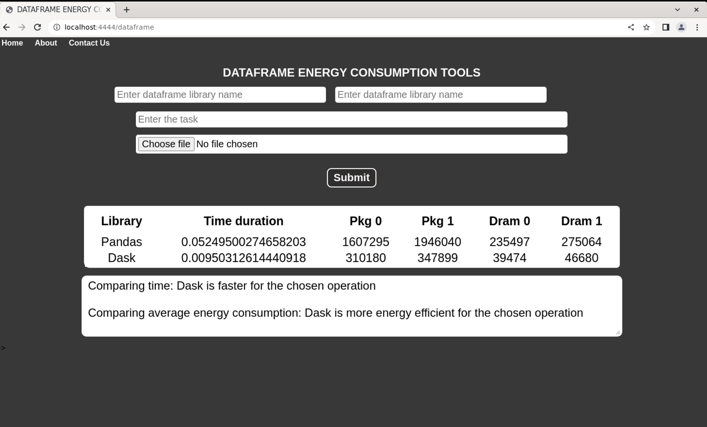
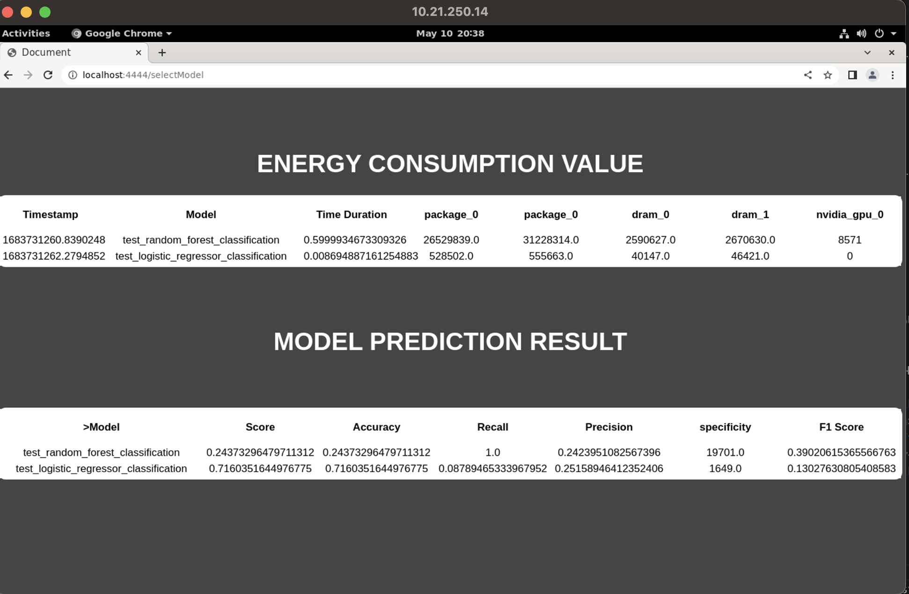

# ISE_Dataframe_ML_Algo_energy_tool

This too provides comprehensive analysis of various dataframe libraries and machie learning algorithms from energy consumption perspective.

## Parameters related to energy traces

- tag
- timestamp
- time_duration
- dram_0
- dram_1
- package_0
- package_1

## Supported Architechture

It monitors the energy consumed by specific device of the host machine such as :

- intel CPU socket package

- RAM (for intel server architectures)

- intel integrated GPU (for client architectures)

- nvidia GPU

## Installation

Clone the repo https://github.com/Rajrupa1998/ISE_Dataframe_ML_Algo_energy_tool

1. Creating virtual environment with `pip install env`
2. `python -m venv venv`
3. `venv/Scripts/Activate`
4.  `source env/bin/Activate`
5. Install required dependencies with `pip install -r requirements.txt`
6. Run `python3 app.py`

## Screenshots

<h3>Landing Page</h3>

<h3>Dataframe Energy Consumption Result</h3>
    
<h3>ML algorithms Energy Consumption Result</h3>
    

 

